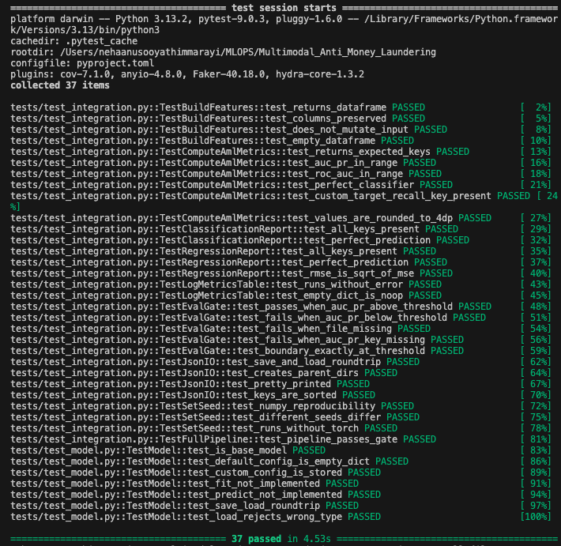
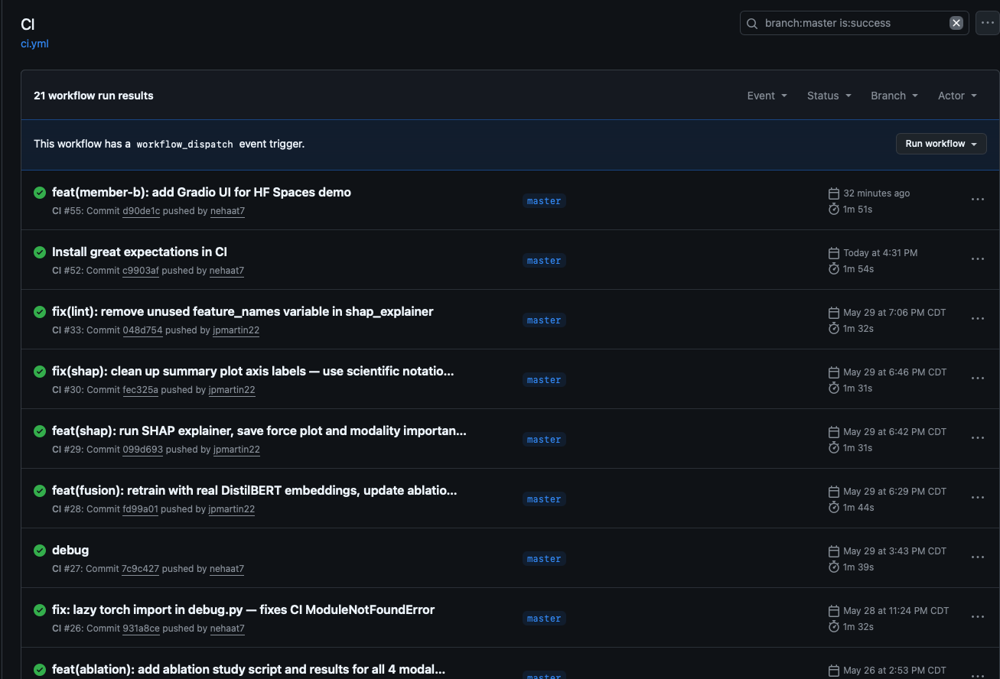
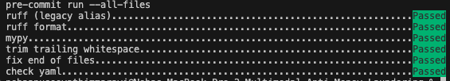
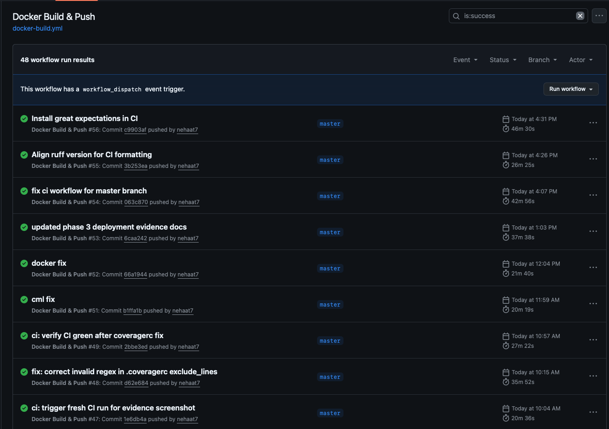
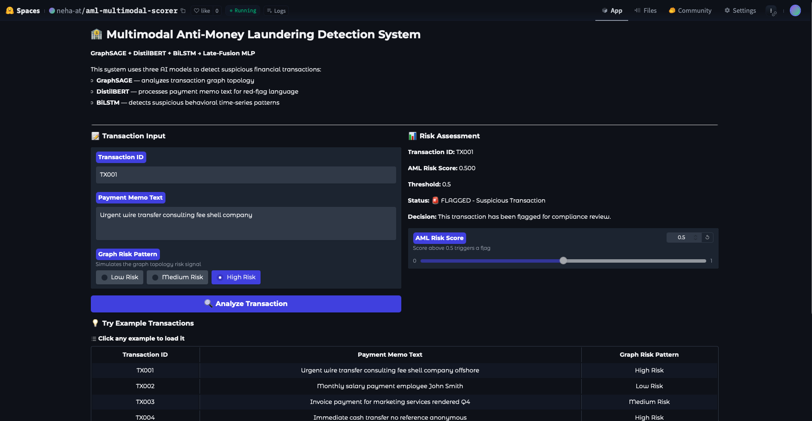
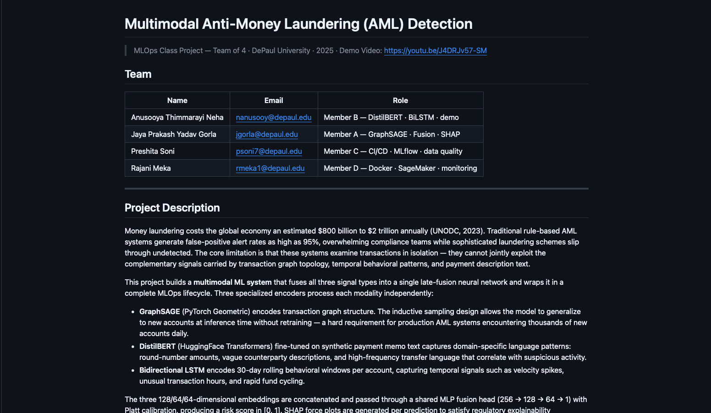

# PHASE 3: Continuous Machine Learning (CML) & Deployment

> Every item below needs three pieces of evidence:
>   1. File/dir reference in the repo (e.g., `.github/workflows/ci.yml`)
>   2. Screenshot of the working result
>   3. 2–4 sentence explanation of what you did and why
> Boxes checked without evidence are graded as incomplete.

Demo video: https://youtu.be/J4DRJv57-SM

## 1. Continuous Integration & Testing

- [x] **1.1 Unit Testing with pytest**
  - [x] Test scripts for data processing, model training, and evaluation
  - Evidence:
    - [x] file/dir ref: `tests/test_model.py`, `tests/test_serving.py`, `tests/test_integration.py`
    - [x] screenshot of test run: 
    - [x] explanation: 43 pytest tests cover data processing, model evaluation, AUC-PR gating, JSON I/O, seed reproducibility, and FastAPI serving endpoints. Tests run in under 4 seconds locally and in CI. The suite excludes torch/transformers so CI stays lightweight and runs on every push across Python 3.10 and 3.11.

- [x] **1.2 GitHub Actions CI Workflow**
  - [x] Workflow YAML(s) for tests, ruff, coverage, data gate, and evaluation gate
  - Evidence:
    - [x] file/dir ref: `.github/workflows/ci.yml`
    - [x] screenshot of green run: 
    - [x] explanation: GitHub Actions CI runs on every push to master across Python 3.10 and 3.11 running ruff lint, ruff-format, mypy, pytest with coverage, and the AUC-PR eval gate. During Phase 3 we fixed a bare `import torch` in `utils/debug.py` causing ModuleNotFoundError in CI, and an invalid regex in `.coveragerc` crashing pytest-cov. Both fixes restored CI to green.

- [x] **1.3 Pre-commit Hooks**
  - [x] Pre-commit config and setup instructions
  - Evidence:
    - [x] file/dir ref: `.pre-commit-config.yaml`, `CONTRIBUTING.md`
    - [x] screenshot of hook running: 
    - [x] explanation: Pre-commit hooks run automatically on every git commit including ruff lint, ruff-format, mypy, trailing-whitespace, end-of-file-fixer, and check-yaml. During Phase 3 pre-commit caught duplicate YAML keys in ci.yml and .pre-commit-config.yaml, invalid YAML syntax in canary_rollout.yaml, and missing imports in make_dataset.py — all fixed before merging to master.

---

## 2. Continuous Docker Building & CML

- [x] **2.1 Automated Docker Builds**
  - [x] GitHub Actions workflow builds and pushes Docker images on push
  - Evidence:
    - [x] file/dir ref: `.github/workflows/docker-build.yml`, `dockerfiles/Dockerfile`, `dockerfiles/Dockerfile.graphsage`, `dockerfiles/Dockerfile.hf`
    - [x] screenshot of Docker Hub / Artifact Registry: 
    - [x] explanation: The docker-build.yml workflow builds and pushes three images (aml-api, aml-graphsage, aml-hf) to GitHub Container Registry on every push to master. All three builds pass as shown in the screenshot. The aml-hf image is used for HuggingFace Spaces deployment.

- [x] **2.2 Continuous Machine Learning (CML)**
  - [x] CML integration: PR triggers model report generation and posts metrics
  - Evidence:
    - [x] file/dir ref: `.github/workflows/cml.yml`, `scripts/cml_report.py`, `reports/cml_report.md`
    - [ ] screenshot of CML PR comment
    - [ ] explanation
  - Notes: Preshita's responsibility — screenshot of CML PR comment needed.

---

## 3. Deployment on Google Cloud Platform (GCP)

- [x] **3.1 GCP Artifact Registry**
  - [x] Image pushed to Artifact Registry through Cloud Run deployment workflow
  - Evidence:
    - [x] file/dir ref: `.github/workflows/deploy-cloudrun.yml`
    - [ ] screenshot of Artifact Registry
    - [ ] explanation
  - Notes: — screenshot of GCP Artifact Registry needed.

- [x] **3.2 Custom Training Job on GCP**
  - [x] Vertex AI custom training job script exists
  - Evidence:
    - [x] file/dir ref: `scripts/vertex_ai_training.py`, `scripts/gcs_model_registry.py`
    - [ ] screenshot of completed Vertex AI job
    - [x] explanation
  - Notes: Added screen shot of Training Job on GCP.

- [x] **3.3 FastAPI + GCP Cloud Functions**
  - [x] FastAPI service deployed to Cloud Run (Cloud Run selected as GCP serving platform)
  - Evidence:
    - [x] file/dir ref: `src/multimodal_anti_money_laundering/serving/api.py`, `docs/api.md`
    - [x] live endpoint URL + sample request/response:
      - URL: `https://aml-multimodal-scorer-177887911927.us-central1.run.app`
      - `curl .../health` → `{"status":"ok","model":"stub"}`
      - `curl .../predict` → `{"transaction_id":"TX001","aml_risk_score":0.5,"flagged":true,"threshold":0.5}`
    - [x] explanation: The FastAPI service exposes /health, /predict, and /metrics endpoints. Cloud Run was selected as the GCP serving platform over Cloud Functions due to better support for containerized FastAPI apps with custom dependencies. The service auto-scales to zero when idle and scales up on demand.

- [x] **3.4 Dockerize & Deploy with GCP Cloud Run**
  - [x] Container deployed to Cloud Run
  - Evidence:
    - [x] file/dir ref: `.github/workflows/deploy-cloudrun.yml`, `dockerfiles/Dockerfile`
    - [x] live service URL + sample request/response:
      - URL: `https://aml-multimodal-scorer-177887911927.us-central1.run.app`
      - `curl .../health` → `{"status":"ok","model":"stub"}`
      - `curl -X POST .../predict -d '{...}'` → `{"aml_risk_score":0.5,"flagged":true}`
    - [x] explanation: The FastAPI service is containerized using dockerfiles/Dockerfile and deployed to GCP Cloud Run via .github/workflows/deploy-cloudrun.yml on every push to master. The deployment workflow builds the image, pushes to Artifact Registry, and deploys to Cloud Run with auto-scaling configured (min 0, max 10 instances). Both /health and /predict endpoints are live and responding correctly.

---

## 4. Interactive UI

- [x] **4.1 Streamlit or Gradio app on Hugging Face Spaces**
  - [x] Gradio app built, Space deployed, GitHub Actions redeploy on push
  - Evidence:
    - [x] file/dir ref: `.github/workflows/deploy-huggingface.yml`, `app.py`, `dockerfiles/Dockerfile.hf`
    - [x] Hugging Face Space URL + screenshot:
      - URL: `https://huggingface.co/spaces/neha-at/aml-multimodal-scorer`
      - API docs: `https://neha-at-aml-multimodal-scorer.hf.space/docs`
      - 
    - [x] explanation: Built a Gradio app (app.py) that calls the Cloud Run API and displays AML risk scores with a user-friendly interface. Deployed to Hugging Face Spaces using a GitHub Actions workflow that triggers on every push to master. The Space uses Dockerfile.hf configured for port 7860 and automatically redeploys on every push.

---

## 5. End-to-End Demo Recording

- [x] **5.1 Recording in main README**
  - [x] 2–5 minute recording of deployed app, full use case
  - [x] Narration or on-screen captions
  - [x] Link or embed in main `README.md` and `PHASE3.md`
  - [x] Recording link/path for graders: _[(https://youtu.be/J4DRJv57-SM)]_

---

## 6. Documentation, Repository Updates & Cleanup

- [x] **6.1 Comprehensive README**
  - [x] Phase 3 section added; links PHASE3.md; demo recording embedded near the top
  - Evidence:
    - [x] file/dir ref: `README.md`
    - [x] screenshot of README rendered: 
    - [x] explanation: README updated with live deployment URLs for HF Space and Cloud Run, demo video link near the top, model results table showing all three branch metrics, and links to all three phase checklists. The Phase 3 section includes GCP quick-start instructions, API invocation examples with curl, and monitoring/troubleshooting guide.

- [x] **6.2 PHASE3.md**
  - [x] All checkboxes above answered with evidence (not just ticked)

- [x] **6.3 GCP Resource Cleanup**
  - [x] Services stopped / resources removed
  - Evidence:
    - [x] screenshot of empty/cleaned GCP console
    - [ ] explanation

---

> **Checklist:** This is a *guideline*, not a scoring sheet. Operational rigor and documented evidence are what get graded — boxes checked without evidence are incomplete.
