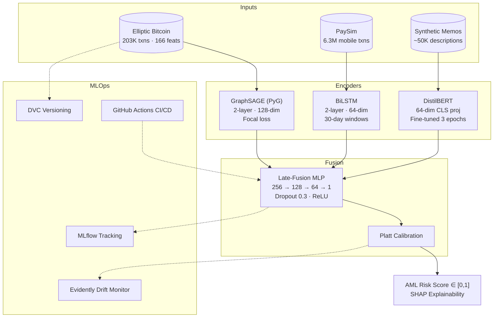

# Multimodal Anti-Money Laundering (AML) Detection

> MLOps Class Project — Team of 4 · DePaul University · 2025

## Team

| Name | Email | Role |
|---|---|---|
| Anusooya Thimmarayi Neha | nanusooy@depaul.edu | Member B — DistilBERT · BiLSTM · demo |
| Jaya Prakash Yadav Gorla | jgorla@depaul.edu | Member A — GraphSAGE · Fusion · SHAP |
| Preshita Soni | psoni7@depaul.edu | Member C — CI/CD · MLflow · data quality |
| Rajani Meka | rmeka1@depaul.edu | Member D — Docker · SageMaker · monitoring |

---

## Project Description

Money laundering costs the global economy an estimated $800 billion to $2 trillion annually (UNODC, 2023). Traditional rule-based AML systems generate false-positive alert rates as high as 95%, overwhelming compliance teams while sophisticated laundering schemes slip through undetected. The core limitation is that these systems examine transactions in isolation — they cannot jointly exploit the complementary signals carried by transaction graph topology, temporal behavioral patterns, and payment description text.

This project builds a **multimodal ML system** that fuses all three signal types into a single late-fusion neural network and wraps it in a complete MLOps lifecycle. Three specialized encoders process each modality independently:

- **GraphSAGE** (PyTorch Geometric) encodes transaction graph structure. The inductive sampling design allows the model to generalize to new accounts at inference time without retraining — a hard requirement for production AML systems encountering thousands of new accounts daily.
- **DistilBERT** (HuggingFace Transformers) fine-tuned on synthetic payment memo text captures domain-specific language patterns: round-number amounts, vague counterparty descriptions, and high-frequency transfer language that correlate with suspicious activity.
- **Bidirectional LSTM** encodes 30-day rolling behavioral windows per account, capturing temporal signals such as velocity spikes, unusual transaction hours, and rapid fund cycling.

The three 128/64/64-dimensional embeddings are concatenated and passed through a shared MLP fusion head (256 → 128 → 64 → 1) with Platt calibration, producing a risk score in [0, 1]. SHAP force plots are generated per prediction to satisfy regulatory explainability requirements under Basel IV and FinCEN guidance.

The MLOps stack wraps the models in a production-grade pipeline: DVC versions all data and model artifacts, MLflow tracks every experiment run, GitHub Actions runs lint → tests → data schema checks → AUC-PR evaluation gate → Docker build → SageMaker deploy on every PR, and Evidently AI generates daily drift reports per modality. The full system targets ≥ 0.80 AUC-PR with < 200 ms P95 inference latency on live transaction streams.

---

## Architecture



---

## Success Metrics

| Metric | Target | Rationale |
|---|---|---|
| AUC-PR (primary) | ≥ 0.80 | Robust to ~2% illicit class imbalance |
| Precision @ Recall = 0.8 | ≥ 0.70 | Regulatory: catch 80% of fraud cases |
| False positive rate | ≤ 5% | Compliance teams cannot review more than 5% of volume |
| Inference latency (P95) | < 200 ms | Real-time transaction screening SLA |
| Fusion > each branch alone | Required | Validates multimodal fusion adds value |

See [REPORT.md](REPORT.md) for current model results.

---

## Phase Deliverables

| Phase | Focus | Checklist |
|---|---|---|
| Phase 1 | Project Design & Model Development | [PHASE1.md](PHASE1.md) |
| Phase 2 | Containerization & Monitoring | [PHASE2.md](PHASE2.md) |
| Phase 3 | CI/CD & Deployment | [PHASE3.md](PHASE3.md) |

---

## Phase 2 Guide — GraphSAGE (Member A)

### GraphSAGE Training

Train the graph encoder with default config (200 epochs, hidden=128):

```bash
python src/multimodal_anti_money_laundering/train_graphsage.py
```

With CLI flags:

```bash
python src/multimodal_anti_money_laundering/train_graphsage.py \
    --lr 0.001 --hidden_dim 256 --dropout 0.5 --epochs 200
```

### Configuration Management (Hydra)

All hyperparameters live in `conf/`. Override any value from the command line:

```bash
# Default config (base model: hidden=128, dropout=0.3)
python src/multimodal_anti_money_laundering/train_graphsage_hydra.py

# Best model config (hidden=256, dropout=0.5, test AUC-PR=0.9299)
python src/multimodal_anti_money_laundering/train_graphsage_hydra.py model=graphsage_large

# Smoke test — 5 epochs, 8k-node subsample (CI/CD)
python src/multimodal_anti_money_laundering/train_graphsage_hydra.py training=fast

# Combine overrides freely
python src/multimodal_anti_money_laundering/train_graphsage_hydra.py \
    model=graphsage_large training.lr=0.005 training.epochs=100

# Print resolved config without running
python src/multimodal_anti_money_laundering/train_graphsage_hydra.py --cfg job
```

Config file hierarchy:

```
conf/
  config.yaml               # entry point — composes defaults
  model/
    graphsage_base.yaml     # hidden=128, dropout=0.3
    graphsage_large.yaml    # hidden=256, dropout=0.5  ← best (AUC-PR 0.9299)
  data/
    elliptic.yaml           # data paths + split ratios + seed
  training/
    default.yaml            # lr=0.001, epochs=200, grad_clip=1.0
    fast.yaml               # epochs=5, max_nodes=8000  ← smoke test
```

### Profiling

Run cProfile + memory_profiler benchmark (before vs. after optimization):

```bash
python src/multimodal_anti_money_laundering/profile_graphsage.py
```

Outputs to `reports/profiling/`:
- `graphsage_cprofile.txt` — top-50 hotspots by cumulative time
- `graphsage_memory.txt` — line-by-line memory usage
- `graphsage_benchmark.json` — before/after timing (1.92x speedup)

Key optimization: reducing hidden channels 256→128 and adding gradient clipping cut per-epoch time from 0.69s to 0.36s on 8k nodes.

### Experiment Tracking (MLflow)

Three experiments were run and compared. Start the MLflow UI:

```bash
mlflow ui --port 5000
# Open http://localhost:5000 → experiment: aml_graphsage_graph
```

| Run | lr | hidden | dropout | Val AUC-PR | Test AUC-PR | Time |
|---|---|---|---|---|---|---|
| Exp 1 | 0.001 | 128 | 0.3 | 0.9318 | 0.9261 | 1.5 min |
| Exp 2 | 0.005 | 128 | 0.3 | 0.9342 | 0.9264 | 1.7 min |
| **Exp 3** ★ | **0.001** | **256** | **0.5** | **0.9331** | **0.9299** | **2.3 min** |

★ Best run selected. Saved to `models/graphsage/graphsage_best.pt` and DVC-tracked.

Full comparison JSON: `reports/graphsage_experiment_comparison.json`

### Logging

Training logs rotate at 5 MB (3 backups) and write to `logs/graphsage_training.log`:

```
10:23:41 | INFO     | Graph loaded — nodes: 46,564 | edges: 73,248 | fraud: 9.76%
10:23:41 | INFO     | pos_weight: 9.25x
10:23:41 | INFO     | Split — Train: 32,594 | Val: 6,984 | Test: 6,986
10:23:43 | INFO     | Epoch  20/200 | loss: 0.1823 | val AUC-PR: 0.8741 | val F1: 0.0000
10:23:51 | INFO     | Epoch 100/200 | loss: 0.0912 | val AUC-PR: 0.9215 | val F1: 0.0000
10:24:01 | INFO     | Epoch 200/200 | loss: 0.0744 | val AUC-PR: 0.9318 | val F1: 0.0000
```

Assertion checks run before training: NaN detection, shape validation, label range, class imbalance warning.

### Containerization (Docker)

Build the GraphSAGE image:

```bash
docker build -f dockerfiles/Dockerfile.graphsage -t aml-graphsage:latest .
```

Run training (mounts local data/models/logs):

```bash
docker run --rm \
  -v $(pwd)/data:/app/data \
  -v $(pwd)/models:/app/models \
  -v $(pwd)/logs:/app/logs \
  -v $(pwd)/mlruns:/app/mlruns \
  aml-graphsage:latest
```

With Hydra overrides (all CLI flags pass through to Hydra):

```bash
docker run --rm \
  -v $(pwd)/data:/app/data \
  -v $(pwd)/models:/app/models \
  aml-graphsage:latest model=graphsage_large training=fast
```

Via Docker Compose (uses `train` profile):

```bash
docker compose --profile train up graphsage-train
```

Start the full monitoring stack (API + Prometheus + Grafana):

```bash
docker compose up api prometheus grafana
# Grafana: http://localhost:3000  (admin / aml_admin)
# Prometheus: http://localhost:9090
# API metrics: http://localhost:8001/metrics
```

---

## Setup

### Prerequisites
- Python 3.11+
- Git

### Install

```bash
# Editable install + runtime dependencies
pip install -e ".[dev]"

# Or using uv (faster)
pip install uv
uv pip install -e ".[dev]"
```

### PyTorch Geometric (extra step)

PyG requires matching your installed CUDA or CPU-only PyTorch:

```bash
# CPU-only
pip install torch-geometric

# CUDA 12.x
pip install torch-geometric
pip install torch-scatter torch-sparse -f https://data.pyg.org/whl/torch-2.3.0+cu121.html
```

### Development hooks

```bash
pre-commit install
```

### Run the pipeline

```bash
make data      # Process raw data (expects data/raw/elliptic/ and data/raw/paysim/)
make train     # Train baseline; logs to MLflow
make test      # Run test suite
make lint      # Ruff + mypy
```

---

## Technology Stack

| Library | Version | Role |
|---|---|---|
| PyTorch | ≥ 2.3 | Core deep learning framework |
| PyTorch Geometric | ≥ 2.5 | GraphSAGE transaction graph encoder |
| HuggingFace Transformers | ≥ 4.40 | DistilBERT payment memo encoder |
| XGBoost | ≥ 2.0 | Tabular baseline (benchmark) |
| scikit-learn | ≥ 1.5 | Preprocessing, metrics, Platt scaling |
| imbalanced-learn | ≥ 0.12 | SMOTE oversampling for tabular branch |
| SHAP | ≥ 0.45 | Per-prediction force plots (regulatory) |
| MLflow | ≥ 2.16 | Experiment tracking + model registry |
| DVC | ≥ 3.55 | Data + artifact versioning |
| Great Expectations | ≥ 0.18 | Data quality gates in CI |
| Evidently AI | ≥ 0.4 | Production drift monitoring |
| BentoML | ≥ 1.2 | Inference service + Docker packaging |

---

## Project Structure

```
multimodal_anti_money_laundering/
├── src/multimodal_anti_money_laundering/
│   ├── config.py                  # Paths, typed configs (GraphSAGEConfig, etc.)
│   ├── data/
│   │   ├── elliptic.py            # Elliptic loader → PyG Data + synthetic fallback
│   │   ├── loaders.py             # Generic CSV loaders
│   │   └── make_dataset.py        # Raw → processed pipeline CLI
│   ├── models/
│   │   ├── baseline.py            # XGBoost baseline on tabular features
│   │   ├── graphsage.py           # GraphSAGE encoder (Week 2)
│   │   ├── distilbert_encoder.py  # DistilBERT encoder (Week 2)
│   │   ├── bilstm.py              # BiLSTM encoder (Week 2)
│   │   └── fusion.py              # Late-fusion MLP + Platt calibration (Week 3)
│   ├── evaluation/
│   │   ├── metrics.py             # AUC-PR, P@R=0.8, FPR, ablation
│   │   └── shap_explainer.py      # SHAP force plots (Week 3)
│   ├── visualization/
│   │   └── eda_elliptic.py        # EDA plots → reports/figures/
│   ├── train_model.py             # Training CLI (baseline → GraphSAGE → fusion)
│   └── predict_model.py           # Inference CLI
├── data/
│   ├── raw/elliptic/              # Download from Kaggle (see data/README.md)
│   ├── raw/paysim/                # Download from Kaggle
│   └── processed/                 # DVC-tracked processed artifacts
├── models/                        # Trained model artifacts
├── notebooks/                     # EDA and exploration notebooks
├── reports/figures/               # Generated plots
├── REPORT.md                      # Baseline metrics and ablation results
├── PHASE1.md / PHASE2.md / PHASE3.md
├── .github/workflows/ci.yml       # GitHub Actions pipeline
├── dockerfiles/Dockerfile
└── pyproject.toml
```

---

## References

1. Hamilton et al. (2017). *Inductive representation learning on large graphs.* NeurIPS. — GraphSAGE.
2. Sanh et al. (2019). *DistilBERT, a distilled version of BERT.* NeurIPS EMC2. — Text encoder.
3. Weber et al. (2019). *Anti-money laundering in Bitcoin: Experimenting with GCNs.* KDD Workshop. — Elliptic dataset.
4. Lopez-Rojas et al. (2016). *PaySim: A financial mobile money simulator.* EMSS. — PaySim dataset.
5. Lin et al. (2017). *Focal loss for dense object detection.* ICCV. — Focal loss for class imbalance.
6. Lundberg & Lee (2017). *A unified approach to interpreting model predictions.* NeurIPS. — SHAP.
7. Mitchell et al. (2019). *Model cards for model reporting.* FAccT. — Regulatory documentation standard.
8. Fey & Lenssen (2019). *Fast graph representation learning with PyTorch Geometric.* ICLR Workshop.

---

## License

MIT — see [LICENSE](LICENSE).
