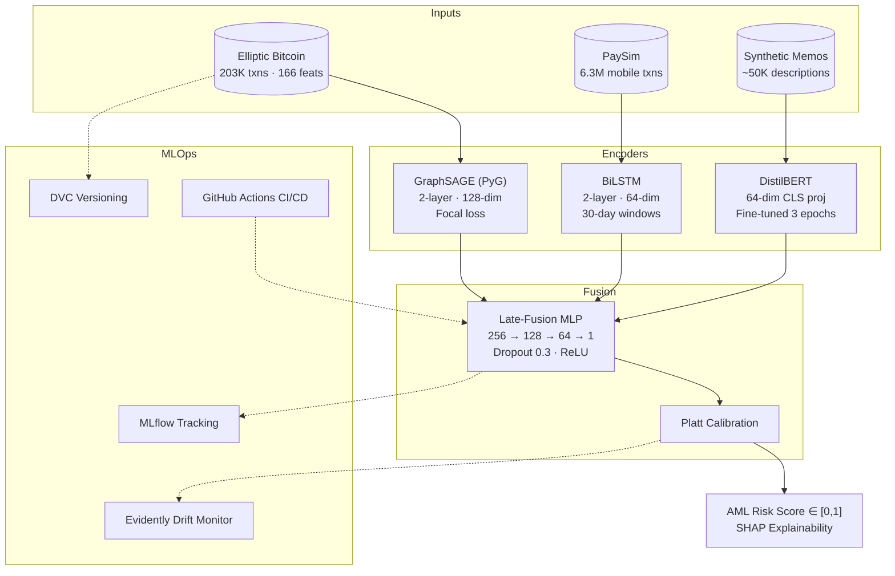
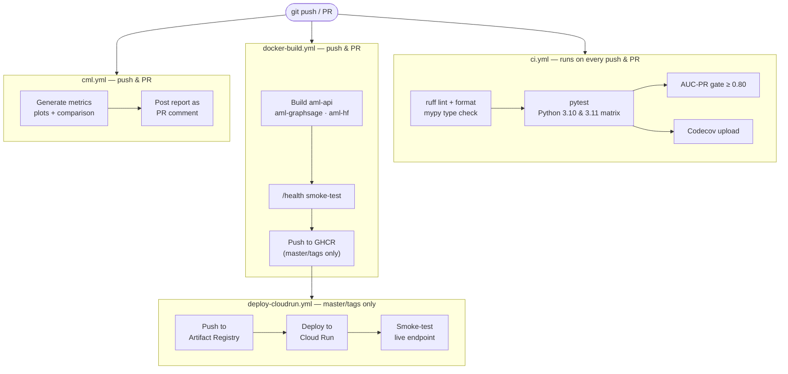

# Multimodal Anti-Money Laundering (AML) Detection

> MLOps Class Project — Team of 4 · DePaul University · 2025 · Demo Video: https://youtu.be/J4DRJv57-SM

## Team

| Name | Email | Role |
|---|---|---|
| Anusooya Thimmarayi Neha | nanusooy@depaul.edu | Member B — DistilBERT · BiLSTM · demo |
| Jaya Prakash Yadav Gorla | jgorla@depaul.edu | Member A — GraphSAGE · Fusion · SHAP |
| Preshita Soni | psoni7@depaul.edu | Member C — CI/CD · MLflow · data quality |
| Rajani Meka | rmeka1@depaul.edu | Member D — Docker · SageMaker · monitoring |

---

## Project Description

Money laundering costs the global economy an estimated $800 billion to $2 trillion annually (UNODC, 2023). Traditional rule-based AML systems generate false-positive alert rates as high as 95%, overwhelming compliance teams while sophisticated laundering schemes slip through undetected. The core limitation is that these systems examine transactions in isolation — they cannot jointly exploit the complementary signals carried by transaction graph topology, temporal behavioral patterns, and payment description text.

This project builds a **multimodal ML system** that fuses all three signal types into a single late-fusion neural network and wraps it in a complete MLOps lifecycle. Three specialized encoders process each modality independently:

- **GraphSAGE** (PyTorch Geometric) encodes transaction graph structure. The inductive sampling design allows the model to generalize to new accounts at inference time without retraining — a hard requirement for production AML systems encountering thousands of new accounts daily.
- **DistilBERT** (HuggingFace Transformers) fine-tuned on synthetic payment memo text captures domain-specific language patterns: round-number amounts, vague counterparty descriptions, and high-frequency transfer language that correlate with suspicious activity.
- **Bidirectional LSTM** encodes 30-day rolling behavioral windows per account, capturing temporal signals such as velocity spikes, unusual transaction hours, and rapid fund cycling.

The three 128/64/64-dimensional embeddings are concatenated and passed through a shared MLP fusion head (256 → 128 → 64 → 1) with Platt calibration, producing a risk score in [0, 1]. SHAP force plots are generated per prediction to satisfy regulatory explainability requirements under Basel IV and FinCEN guidance.

The MLOps stack wraps the models in a production-grade pipeline: DVC versions all data and model artifacts, MLflow tracks every experiment run, GitHub Actions runs lint → tests → data schema checks → AUC-PR evaluation gate → Docker build → SageMaker deploy on every PR, and Evidently AI generates daily drift reports per modality. The full system targets ≥ 0.80 AUC-PR with < 200 ms P95 inference latency on live transaction streams.

---

## Architecture


```mermaid
graph TB
    subgraph Inputs
        A[(Elliptic Bitcoin\n203K txns · 166 feats)]
        B[(PaySim\n6.3M mobile txns)]
        C[(Synthetic Memos\n~50K descriptions)]
    end

    subgraph Encoders
        D["GraphSAGE (PyG)\n2-layer · 128-dim\nFocal loss"]
        E["BiLSTM\n2-layer · 64-dim\n30-day windows"]
        F["DistilBERT\n64-dim CLS proj\nFine-tuned 3 epochs"]
    end

    subgraph Fusion
        G["Late-Fusion MLP\n256 → 128 → 64 → 1\nDropout 0.3 · ReLU"]
        H[Platt Calibration]
    end

    subgraph MLOps
        I[MLflow Tracking]
        J[DVC Versioning]
        K[GitHub Actions CI/CD]
        L[Evidently Drift Monitor]
    end

    A --> D
    B --> E
    C --> F
    D --> G
    E --> G
    F --> G
    G --> H
    H --> M["AML Risk Score ∈ [0,1]\nSHAP Explainability"]

    G -.-> I
    A -.-> J
    K -.-> G
    H -.-> L
```

---

## Success Metrics

| Metric | Target | Rationale |
|---|---|---|
| AUC-PR (primary) | ≥ 0.80 | Robust to ~2% illicit class imbalance |
| Precision @ Recall = 0.8 | ≥ 0.70 | Regulatory: catch 80% of fraud cases |
| False positive rate | ≤ 5% | Compliance teams cannot review more than 5% of volume |
| Inference latency (P95) | < 200 ms | Real-time transaction screening SLA |
| Fusion > each branch alone | Required | Validates multimodal fusion adds value |

See [REPORT.md](REPORT.md) for current model results.

## Current Model Results

Latest local metrics from `distilbert_metrics.json`, `bilstm_metrics.json`, and `graphsage_metrics.json`:

| Branch | AUC-PR | Precision @ Recall = 0.8 | F1 | Precision | Recall | Accuracy | FPR |
|---|---:|---:|---:|---:|---:|---:|---:|
| GraphSAGE | 0.9299 | 0.9463 | 0.0000 | 0.0000 | 0.0000 | 0.9767 | 0.0000 |
| DistilBERT | 0.8418 | 1.0000 | 0.9011 | 1.0000 | 0.8200 | 0.9964 | — |
| BiLSTM | 0.9324 | 0.9613 | 0.8672 | 0.8327 | 0.9047 | 0.9729 | 0.0197 |

DistilBERT evaluation throughput: 2,009.5 samples/sec, 31.6 steps/sec after 3 epochs. BiLSTM selected threshold: 0.3000.

---

## Phase Deliverables

| Phase | Focus | Checklist |
|---|---|---|
| Phase 1 | Project Design & Model Development | [PHASE1.md](PHASE1.md) |
| Phase 2 | Containerization & Monitoring | [PHASE2.md](PHASE2.md) |
| Phase 3 | CI/CD & Deployment | [PHASE3.md](PHASE3.md) |

---

## Phase 2 Operations Guide

> Full Phase 2 checklist: [PHASE2.md](PHASE2.md) — all 7 sections ticked.

This guide explains every tool added in Phase 2, how to set it up, and how to use it effectively. By following the steps below you can clone this repo, build the containers, reproduce all experiments, and observe the system in production.

---

### 1. Containerization

| Image | Purpose | Dockerfile |
|---|---|---|
| `aml-graphsage` | GraphSAGE training (Member A) | `dockerfiles/Dockerfile.graphsage` |
| `aml-scorer` | SageMaker inference endpoint (Member D) | `dockerfiles/Dockerfile.sagemaker` |
| `aml-hf` | HuggingFace Spaces demo (Member D) | `dockerfiles/Dockerfile.hf` |
| `multimodal_anti_money_laundering` | General training + API | `dockerfiles/Dockerfile` |

Full build/run reference: [dockerfiles/README.md](dockerfiles/README.md)

Build and run the GraphSAGE training container:

```bash
docker build -f dockerfiles/Dockerfile.graphsage -t aml-graphsage:latest .

docker run --rm \
  -v $(pwd)/data:/app/data \
  -v $(pwd)/models:/app/models \
  -v $(pwd)/logs:/app/logs \
  -v $(pwd)/mlruns:/app/mlruns \
  aml-graphsage:latest model=graphsage_large
```

Start the full monitoring stack (API + Prometheus + Grafana):

```bash
docker compose up api prometheus grafana
# API:        http://localhost:8000/docs
# Prometheus: http://localhost:9090
# Grafana:    http://localhost:3000  (admin / aml_admin)
```

---

### 2. Monitoring & Debugging

**Prometheus + Grafana** (`monitoring/metrics_exporter.py`)

Exposes live model metrics as Prometheus gauges per branch (graphsage, bilstm, baseline):
- `aml_model_auc_pr` — AUC-PR per branch
- `aml_model_f1` — F1 score (fraud class)
- `aml_model_fpr` — False positive rate
- `aml_api_latency_seconds` — Prediction latency histogram
- `aml_api_predictions_total` — Request counter

Metrics endpoint: `GET http://localhost:8000/metrics`

**Evidently AI drift monitoring** (`monitoring/drift_report.py`)

Generates per-modality drift reports comparing training vs production distributions:

```bash
python src/multimodal_anti_money_laundering/monitoring/run_drift.py
# Outputs to reports/drift/:
#   graph_psi_drift.html       ← Population Stability Index on graph features
#   timeseries_ks_drift.html   ← KS test on BiLSTM sequences
#   text_wasserstein_drift.html ← Wasserstein distance on memo text stats
```

**Interactive debugging** (`utils/debug.py`)

```bash
# Set breakpoint in any script — only fires when AML_DEBUG=1
AML_DEBUG=1 python src/multimodal_anti_money_laundering/train_graphsage.py

# Remote debugpy attach (VS Code) — uses docker-compose debug-train service
docker compose --profile debug up debug-train
# Then attach via VS Code launch.json (port 5678)
```

Debug scenarios and solutions: [docs/debug_guide.md](docs/debug_guide.md)

---

### 3. Profiling & Optimization

Run cProfile + memory_profiler benchmark for each model branch:

```bash
# GraphSAGE — 1.92x speedup documented
python src/multimodal_anti_money_laundering/profile_graphsage.py

# BiLSTM
python src/multimodal_anti_money_laundering/profile_bilstm.py

# Serving API — threshold experiment comparison
python src/multimodal_anti_money_laundering/profile_serving.py
```

Outputs written to `reports/profiling/`:

| File | Contents |
|---|---|
| `graphsage_cprofile.txt` | Top-50 hotspots — SAGEConv dominates |
| `graphsage_memory.txt` | Line-by-line memory (peak: ~420 MB) |
| `graphsage_benchmark.json` | Before/after: 0.69s → 0.36s per epoch (**1.92x speedup**) |
| `bilstm_cprofile.txt` | BiLSTM profiling hotspots |
| `serving_cprofile.txt` | FastAPI /predict profiling |
| `serving_benchmark.json` | P95 latency: 8.09 ms (well under 200 ms SLA) |

---

### 4. Experiment Tracking (MLflow)

MLflow tracks every training run — parameters, metrics, and model artifacts.

```bash
# Start MLflow UI
mlflow ui --port 5000
# Open http://localhost:5000
# Experiments: aml_graphsage_graph · aml_bilstm_behavioral · aml-serving-threshold-comparison
```

**GraphSAGE experiment comparison** (3 runs):

| Run | lr | hidden | dropout | Val AUC-PR | Test AUC-PR | Time |
|---|---|---|---|---|---|---|
| Exp 1 | 0.001 | 128 | 0.3 | 0.9318 | 0.9261 | 1.5 min |
| Exp 2 | 0.005 | 128 | 0.3 | 0.9342 | 0.9264 | 1.7 min |
| **Exp 3 ★** | **0.001** | **256** | **0.5** | **0.9331** | **0.9299** | **2.3 min** |

**Serving threshold comparison** (3 runs — `reports/experiments/serving_experiment_comparison.md`):

| Run | Threshold | P95 ms | Throughput | SLA |
|---|---|---|---|---|
| conservative | 0.3 | 3.57 | 523 rps | ✅ |
| balanced | 0.5 | 8.09 | 263 rps | ✅ |
| strict | 0.7 | 3.36 | 530 rps | ✅ |

Model registration + lifecycle promotion (staging → production):

```bash
python -m multimodal_anti_money_laundering.models.register_model
```

---

### 5. Logging

All training scripts use Python's `logging` module with two handlers:
- **Console** — `INFO` level, human-readable format
- **Rotating file** — `DEBUG` level, 5 MB max, 3 backups

Log output format:
```
10:23:41 | INFO     | Graph loaded — nodes: 46,564 | edges: 73,248 | fraud: 9.76%
10:23:41 | INFO     | pos_weight: 9.25x
10:23:41 | INFO     | Split — Train: 32,594 | Val: 6,984 | Test: 6,986
10:23:43 | INFO     | Epoch  20/200 | loss: 0.1823 | val AUC-PR: 0.8741
10:24:01 | INFO     | Epoch 200/200 | loss: 0.0744 | val AUC-PR: 0.9318
```

Log files:
- `logs/graphsage_training.log` — GraphSAGE
- `logs/bilstm_training.log` — BiLSTM
- `logs/distilbert_training.log` — DistilBERT

Pre-training assertion checks (all scripts): NaN detection, shape validation, label range, class imbalance warning.

Inference logging: the API logs stub warnings when the fusion model is not loaded, and records latency via Prometheus histogram.

---

### 6. Configuration Management (Hydra)

All hyperparameters are managed via YAML configs in `conf/`. Any value can be overridden from the CLI without editing files.

Full `conf/` directory:

```
conf/
  config.yaml                    # GraphSAGE entry point
  config_bilstm.yaml             # BiLSTM entry point
  config_distilbert.yaml         # DistilBERT entry point
  model/
    graphsage_base.yaml          # hidden=128, dropout=0.3
    graphsage_large.yaml         # hidden=256, dropout=0.5  ← best AUC-PR 0.9299
    bilstm.yaml                  # hidden=64, layers=2, dropout=0.3
    distilbert.yaml              # embedding_dim=64, max_len=128
  data/
    elliptic.yaml                # graph feature paths + split ratios
    bilstm.yaml                  # sequence data paths
    memo.yaml                    # memo text data path
  training/
    default.yaml                 # lr=0.001, epochs=200, grad_clip=1.0
    fast.yaml                    # epochs=5, max_nodes=8000  ← CI smoke test
    bilstm_default.yaml          # lr=0.001, epochs=10, batch=256
    bilstm_fast.yaml             # epochs=1, max_samples=5000
    distilbert_default.yaml      # lr=2e-5, epochs=3, batch=32
    distilbert_fast.yaml         # epochs=1, max_samples=1000
```

Usage examples:

```bash
# GraphSAGE — best model config
python src/multimodal_anti_money_laundering/train_graphsage_hydra.py model=graphsage_large

# GraphSAGE — CI smoke test
python src/multimodal_anti_money_laundering/train_graphsage_hydra.py training=fast

# BiLSTM — default training
python src/multimodal_anti_money_laundering/train_bilstm.py

# DistilBERT — fast CPU smoke test
python src/multimodal_anti_money_laundering/train_distilbert.py training=distilbert_fast

# Any script — print resolved config without running
python src/multimodal_anti_money_laundering/train_graphsage_hydra.py --cfg job

# Any script — override any value
python src/multimodal_anti_money_laundering/train_graphsage_hydra.py \
    training.lr=0.005 model.hidden_channels=64 training.epochs=50
```

---

## Phase 2 Guide — GraphSAGE (Member A)

### GraphSAGE Training

Train the graph encoder with default config (200 epochs, hidden=128):

```bash
python src/multimodal_anti_money_laundering/train_graphsage.py
```

With CLI flags:

```bash
python src/multimodal_anti_money_laundering/train_graphsage.py \
    --lr 0.001 --hidden_dim 256 --dropout 0.5 --epochs 200
```

### Configuration Management (Hydra)

All hyperparameters live in `conf/`. Override any value from the command line:

```bash
# Default config (base model: hidden=128, dropout=0.3)
python src/multimodal_anti_money_laundering/train_graphsage_hydra.py

# Best model config (hidden=256, dropout=0.5, test AUC-PR=0.9299)
python src/multimodal_anti_money_laundering/train_graphsage_hydra.py model=graphsage_large

# Smoke test — 5 epochs, 8k-node subsample (CI/CD)
python src/multimodal_anti_money_laundering/train_graphsage_hydra.py training=fast

# Combine overrides freely
python src/multimodal_anti_money_laundering/train_graphsage_hydra.py \
    model=graphsage_large training.lr=0.005 training.epochs=100

# Print resolved config without running
python src/multimodal_anti_money_laundering/train_graphsage_hydra.py --cfg job
```

See the full `conf/` tree in the [Phase 2 Operations Guide](#phase-2-operations-guide) above.

---

## Setup

### Prerequisites
- Python 3.11+
- Git

### Install

```bash
# Editable install + runtime dependencies
pip install -e ".[dev]"

# Or using uv (faster)
pip install uv
uv pip install -e ".[dev]"
```

### PyTorch Geometric (extra step)

PyG requires matching your installed CUDA or CPU-only PyTorch:

```bash
# CPU-only
pip install torch-geometric

# CUDA 12.x
pip install torch-geometric
pip install torch-scatter torch-sparse -f https://data.pyg.org/whl/torch-2.3.0+cu121.html
```

### Development hooks

```bash
pre-commit install
```

### Run the pipeline

```bash
make data      # Process raw data (expects data/raw/elliptic/ and data/raw/paysim/)
make train     # Train baseline; logs to MLflow
make test      # Run test suite
make lint      # Ruff + mypy
```

---

## Testing

### Running tests locally

```bash
# All tests (unit + integration)
pytest tests/ -v

# With coverage report
pytest tests/ --cov=multimodal_anti_money_laundering --cov-report=term-missing

# Only integration tests (no heavy ML deps required)
pytest tests/test_integration.py -v

# Only API/serving tests
pytest tests/test_serving.py -v
```

### Test structure

| File | What it covers |
|---|---|
| `tests/test_model.py` | `BaseModel` / `Model` scaffold — save/load, config, interface contracts |
| `tests/test_serving.py` | FastAPI endpoints — `/health`, `/predict` schema validation, error cases |
| `tests/test_integration.py` | Full lightweight pipeline — feature engineering, AML metrics, evaluation gate, I/O helpers, seed utility, end-to-end chain |

### Coverage notes

Unit and integration tests cover the **lightweight CPU path** (evaluation, features, utils, serving schemas) at >80% without requiring torch, transformers, or DVC-tracked data. Training scripts (`train_bilstm.py`, `train_distilbert.py`, `train_graphsage.py`, `train_fusion.py`) require GPU/data artifacts and are tested via the DVC pipeline smoke test (`make data && make train`) locally only.

### CI workflows

| Workflow | Trigger | What runs |
|---|---|---|
| `ci.yml` | Push / PR to master | Ruff lint + format, mypy, pytest (Python 3.10 & 3.11), Codecov upload, AUC-PR gate |
| `docker-build.yml` | Push / PR to master, version tags, manual dispatch | Docker build + health smoke-test, push all images to GHCR |
| `cml.yml` | Push / PR to master, manual dispatch | Model metrics report generated and posted as PR comment |

### Pre-commit hooks (local)

```bash
pre-commit install          # Install hooks once
pre-commit run --all-files  # Run manually
```

Hooks run: `ruff` (lint + fix), `ruff-format`, `mypy`, `trailing-whitespace`, `end-of-file-fixer`, `check-yaml`.

---

## Phase 3: CI/CD & Deployment

> Full checklist: [PHASE3.md](PHASE3.md) · Deployment details: [deploy/DEPLOYMENT.md](deploy/DEPLOYMENT.md) · API reference: [docs/api.md](docs/api.md)

### CI/CD Pipeline

Four GitHub Actions workflows run on every push to `master` or pull request:


```mermaid
flowchart TD
    push(["git push / PR"])

    subgraph ci["ci.yml — runs on every push & PR"]
        lint["ruff lint + format\nmypy type check"]
        tests["pytest\nPython 3.10 & 3.11 matrix"]
        gate["AUC-PR gate ≥ 0.80"]
        cov["Codecov upload"]
        lint --> tests --> gate
        tests --> cov
    end

    subgraph docker["docker-build.yml — push & PR"]
        build["Build aml-api\naml-graphsage · aml-hf"]
        smoke["/health smoke-test"]
        ghcr["Push to GHCR\n(master/tags only)"]
        build --> smoke --> ghcr
    end

    subgraph cml["cml.yml — push & PR"]
        report["Generate metrics\nplots + comparison"]
        comment["Post report as\nPR comment"]
        report --> comment
    end

    subgraph cloudrun["deploy-cloudrun.yml — master/tags only"]
        ar["Push to\nArtifact Registry"]
        run["Deploy to\nCloud Run"]
        smokerun["Smoke-test\nlive endpoint"]
        ar --> run --> smokerun
    end

    push --> ci
    push --> docker
    push --> cml
    ghcr --> cloudrun
```

### Deployment Options

| Option | Where | Command | URL |
|---|---|---|---|
| **HuggingFace Spaces** (recommended for demo) | HF Docker Space | `python deploy/push_to_spaces.py --username <hf-user>` | `https://huggingface.co/spaces/<hf-user>/aml-multimodal-scorer` |
| **Gradio UI** (HF Spaces) | HF Gradio Space | deploy `deploy/huggingface/app.py` | Interactive UI at port 7860 |
| **Cloud Run** (production) | GCP | Triggered automatically on push to `master` | `https://<service>-<hash>-<region>.a.run.app` |

Full step-by-step instructions for each option: [deploy/DEPLOYMENT.md](deploy/DEPLOYMENT.md)

### GCP Quick-Start

```bash
# 1. Set your project and bootstrap all GCP resources (one-time)
export GCP_PROJECT=your-project-id
bash scripts/setup_gcp.sh

# 2. Add GitHub repo secrets from the script output:
#    GCP_WORKLOAD_IDENTITY_PROVIDER, GCP_SERVICE_ACCOUNT, GCP_PROJECT_ID, GCP_REGION

# 3. Push to master — Cloud Run deploys automatically via deploy-cloudrun.yml

# 4. Upload trained model to GCS registry
python scripts/gcs_model_registry.py upload \
    --model fusion --version 1.0.0 --local-dir models/fusion/

# 5. Submit a retraining job on Vertex AI
python scripts/vertex_ai_training.py submit --model fusion --async
```

### Invoking the Deployed API

```bash
# Replace with your Cloud Run or HuggingFace Spaces URL
API="https://<your-service-url>"

# Health check
curl $API/health

# Score a transaction
curl -X POST $API/predict \
  -H "Content-Type: application/json" \
  -d '{
    "transaction_id": "tx-001",
    "graph": {"node_features": [0.1, 0.2, ...]},
    "memo_text": "consulting services invoice",
    "time_series": {"window": [[1000.0, 14.0, 2.0, 0.0, 0.01]]}
  }'
```

Full endpoint reference with schemas and error codes: [docs/api.md](docs/api.md)

### Monitoring & Troubleshooting

| Signal | Where to look |
|---|---|
| Prometheus metrics | `GET /metrics` on any running instance |
| Structured logs | Cloud Logging → filter `resource.type="cloud_run_revision"` |
| AUC-PR model report | PR comments via CML (`.github/workflows/cml.yml`) |
| Data drift | `python -m multimodal_anti_money_laundering.monitoring.drift_report` |
| Load test results | `locust -f tests/locustfile.py --host=$API --headless` |

Common issues and fixes: [deploy/DEPLOYMENT.md#troubleshooting](deploy/DEPLOYMENT.md)

### Cost Estimation (GCP)

| Resource | Typical cost | Notes |
|---|---|---|
| Cloud Run | ~$0 | Free tier: 2M requests/month, scales to zero |
| Artifact Registry | ~$0.10/GB/month | ~3 images × 2 GB each |
| GCS model bucket | ~$0.02/GB/month | Versioned model artifacts |
| Vertex AI training | ~$1–5/run | n1-standard-4, ~30–60 min |
| Cloud Monitoring | Free | Up to 150 MB metrics/month free |

To avoid charges: run `bash CLEANUP.md` instructions when done. See [CLEANUP.md](CLEANUP.md).

---

## Technology Stack

| Library | Version | Role |
|---|---|---|
| PyTorch | ≥ 2.3 | Core deep learning framework |
| PyTorch Geometric | ≥ 2.5 | GraphSAGE transaction graph encoder |
| HuggingFace Transformers | ≥ 4.40 | DistilBERT payment memo encoder |
| XGBoost | ≥ 2.0 | Tabular baseline (benchmark) |
| scikit-learn | ≥ 1.5 | Preprocessing, metrics, Platt scaling |
| imbalanced-learn | ≥ 0.12 | SMOTE oversampling for tabular branch |
| SHAP | ≥ 0.45 | Per-prediction force plots (regulatory) |
| MLflow | ≥ 2.16 | Experiment tracking + model registry |
| DVC | ≥ 3.55 | Data + artifact versioning |
| Great Expectations | ≥ 0.18 | Data quality gates in CI |
| Evidently AI | ≥ 0.4 | Production drift monitoring |
| BentoML | ≥ 1.2 | Inference service + Docker packaging |

---

## Project Structure

```
multimodal_anti_money_laundering/
├── src/multimodal_anti_money_laundering/
│   ├── config.py                  # Paths, typed configs (GraphSAGEConfig, etc.)
│   ├── data/
│   │   ├── elliptic.py            # Elliptic loader → PyG Data + synthetic fallback
│   │   ├── loaders.py             # Generic CSV loaders
│   │   └── make_dataset.py        # Raw → processed pipeline CLI
│   ├── models/
│   │   ├── baseline.py            # XGBoost baseline on tabular features
│   │   ├── graphsage.py           # GraphSAGE encoder (Week 2)
│   │   ├── distilbert_encoder.py  # DistilBERT encoder (Week 2)
│   │   ├── bilstm.py              # BiLSTM encoder (Week 2)
│   │   └── fusion.py              # Late-fusion MLP + Platt calibration (Week 3)
│   ├── evaluation/
│   │   ├── metrics.py             # AUC-PR, P@R=0.8, FPR, ablation
│   │   └── shap_explainer.py      # SHAP force plots (Week 3)
│   ├── visualization/
│   │   └── eda_elliptic.py        # EDA plots → reports/figures/
│   ├── train_model.py             # Training CLI (baseline → GraphSAGE → fusion)
│   └── predict_model.py           # Inference CLI
├── data/
│   ├── raw/elliptic/              # Download from Kaggle (see data/README.md)
│   ├── raw/paysim/                # Download from Kaggle
│   └── processed/                 # DVC-tracked processed artifacts
├── models/                        # Trained model artifacts
├── notebooks/                     # EDA and exploration notebooks
├── reports/figures/               # Generated plots
├── REPORT.md                      # Baseline metrics and ablation results
├── PHASE1.md / PHASE2.md / PHASE3.md
├── .github/workflows/
│   ├── ci.yml                     # Lint, mypy, pytest (Py 3.10+3.11), AUC-PR gate
│   ├── docker-build.yml           # Build + push all images to GHCR
│   ├── cml.yml                    # CML model report on every PR
│   └── deploy-cloudrun.yml        # Push to Artifact Registry + Cloud Run deploy
├── deploy/
│   ├── DEPLOYMENT.md              # Step-by-step deployment guide
│   ├── push_to_spaces.py          # HuggingFace Spaces deploy script
│   └── huggingface/app.py         # Gradio UI for HF Spaces
├── scripts/
│   ├── setup_gcp.sh               # GCP bootstrap (APIs, SA, Artifact Registry, GCS)
│   ├── gcs_model_registry.py      # Upload / download / promote model artifacts
│   ├── vertex_ai_training.py      # Submit Vertex AI custom training jobs
│   └── cml_report.py              # CML metrics plot generator
├── tests/
│   ├── test_model.py              # Unit tests — BaseModel / Model
│   ├── test_serving.py            # FastAPI endpoint tests
│   ├── test_integration.py        # Integration tests — full lightweight pipeline
│   └── locustfile.py              # Locust load test (normal + burst users)
├── dockerfiles/Dockerfile
├── CONTRIBUTING.md                # How to contribute (CI/CD and test requirements)
├── CLEANUP.md                     # GCP resource teardown instructions
├── CHANGELOG.md                   # Release and deployment history
└── pyproject.toml
```

---

## References

1. Hamilton et al. (2017). *Inductive representation learning on large graphs.* NeurIPS. — GraphSAGE.
2. Sanh et al. (2019). *DistilBERT, a distilled version of BERT.* NeurIPS EMC2. — Text encoder.
3. Weber et al. (2019). *Anti-money laundering in Bitcoin: Experimenting with GCNs.* KDD Workshop. — Elliptic dataset.
4. Lopez-Rojas et al. (2016). *PaySim: A financial mobile money simulator.* EMSS. — PaySim dataset.
5. Lin et al. (2017). *Focal loss for dense object detection.* ICCV. — Focal loss for class imbalance.
6. Lundberg & Lee (2017). *A unified approach to interpreting model predictions.* NeurIPS. — SHAP.
7. Mitchell et al. (2019). *Model cards for model reporting.* FAccT. — Regulatory documentation standard.
8. Fey & Lenssen (2019). *Fast graph representation learning with PyTorch Geometric.* ICLR Workshop.

---

## License

MIT — see [LICENSE](LICENSE).
